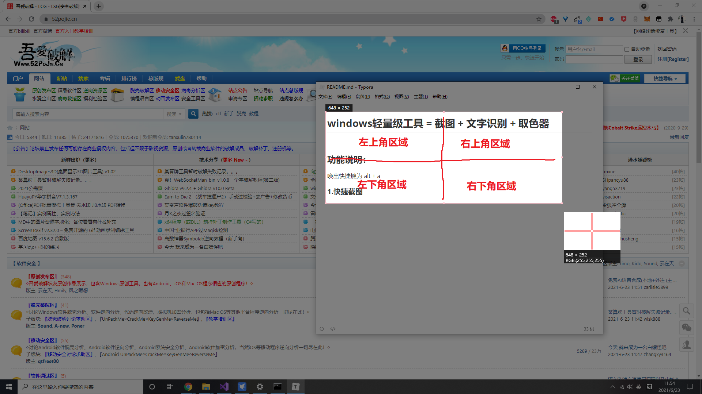

## windows轻量级工具 = 截图 + 文字识别 + 取色器

### 特点：
1. 轻量级，内存占用仅20MB，不截图时CPU占用为0%，截图时占用在1~3%；
2. **用户无感知（设计初衷）**，
	* 截图功能不管是QQ还是微信都有，但是每次截图或者文字识别都要打开QQ，然后登录，然后等消息和弹窗弹弹弹，然后再开始截图，十几秒过去了，体验极差，而该软件只需要瞬间；
	* 无窗口，无托盘，不会占用屏幕任何一块地方，用户不必在意或者知道它的存在，只需像系统本来就自带的软件使用即可（设计目的亦如此，像使用系统原生功能一样使用它）；
3. 增加了取色器功能，取色器也是前端和UI设计时常用的功能；

### 功能说明：

### 唤出快捷键为 alt + a

#### 1.快捷截图

* 选择完截图区域后，双击所选截图区域的左上角区域将**图片复制到剪贴板**
* 双击所截图区域的左下角区域将图片**保存至桌面**；

#### 2.文字识别

* 双击所选截图区域的右上角区域进行**通用文字识别**
* 双击所选截图区域的右下角区域进行**手写体文字识别**

#### 3.取色

* 使用alt + a唤出截图软件后，鼠标移动的位置会自动显示rgb值

#### 4.取消截图or重新选择截图区域
* 在你当前选择的截图区域外单机右键即可重新选择截图区域
* 再单击右键即可退出截图；

### 使用说明
===========================**直接使用**===========================

1. 从Release中下载msi文件，双击安装；

   

2. 安装完成后，进入你的安装目录(默认为：C:\Program Files (x86)\Default Company Name\小小截图\)，将config.ini文件内的密钥改为你自己的（须在[腾讯云创建密钥并开通OCR服务](https://cloud.tencent.com/document/product/866/34681#null)，每月1000免费额度）；

   

   **注意等号两侧各有一个空格分隔；**

   

3. 启动程序（之后每次开机会自启，无需手动）；

===========================**自己编译**===========================
1. .net framwork 版本为4.7.1，自行下载安装；
2. clone项目，用vs2019打开sln文件导入项目；
3. 右键*小小截图*项目，重新生成即可；